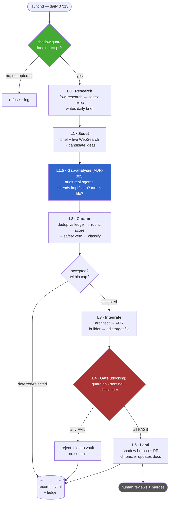
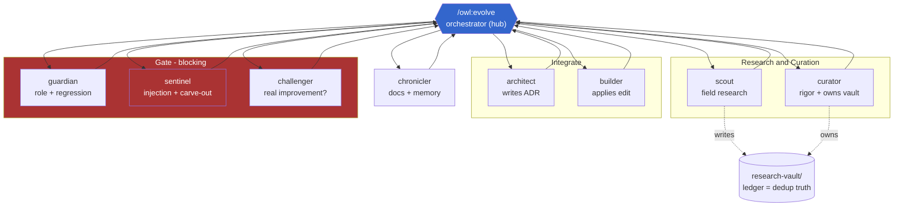
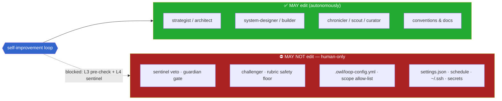

# the-owl — Architecture Diagrams

Visual reference for the self-improvement loop. Diagrams are [Mermaid](https://mermaid.js.org/) (render natively on GitHub; pure text, no runtime — consistent with the-owl's markdown-only identity). Authoritative details live in `docs/decisions/ADR-001..010` and `docs/planning/prd-owl-self-improvement.md`.

---

## 1. The daily loop — L0→L5 (`/owl:evolve`)

How one autonomous cycle flows from research to a landed change. The gate is **blocking**; landing is **shadow (PR)** by default.



---

## 2. Agent topology — hub-and-spoke

The orchestrator (`/owl:evolve`) is the only caller; specialists **hand off and return control**, never call each other. Research/curation agents are new; integrate + gate reuse existing DevFlow agents.



---

## 3. Safety model — the NFR-SEC-1 carve-out (ADR-001)

**Why autonomous-commit is acceptable:** the loop can improve any agent *except its own brakes*. The carve-out is enforced at L3 (pre-check) and L4 (sentinel).



---

## 4. Shadow landing & git flow

Default is **shadow**: the loop proposes on a branch; a human is the merge gate. `main` is never touched autonomously (until `landing: main` is deliberately set).

```mermaid
sequenceDiagram
    participant Cron as launchd (daily)
    participant Loop as /owl:evolve
    participant Gate as guardian+sentinel+challenger
    participant Git as GitHub
    participant Human as Human (merge gate)

    Cron->>Loop: fire 07:13 (shadow guard: landing==pr)
    Loop->>Loop: L0–L3 (research → score → ADR + edit)
    Loop->>Gate: L4 review the proposed diff
    alt any FAIL
        Gate-->>Loop: FAIL → reject, log to vault, no commit
    else all PASS
        Gate-->>Loop: PASS
        Loop->>Git: push branch owl/evolve-DATE-{id} (+ open PR if token)
        Note over Git: main untouched
        Human->>Git: review PR
        Human->>Git: merge → main
    end
```

---

## Rubric (curator's gate) — for reference

| Criterion | Weight |
|---|---|
| Fit to architecture (markdown-only, no-runtime, hub-spoke, context-minimal) | 25 |
| Evidence strength (multiple high-star repos / primary sources) | 20 |
| Impact (quality / coordination / token-efficiency) | 20 |
| Simplicity & reversibility (small, atomic, no new runtime) | 15 |
| Safety (no new attack surface; respects governance) | 10 |
| Non-duplication | 10 |

Accept ≥ threshold (starts **75**, ratchets **+5/minor**, cap **90**) · Reject < 60 · **Hard veto:** Safety sub-score < 7 auto-rejects regardless of total. Config in `.owl/loop-config.yml` (inside the carve-out). See ADR-003.
